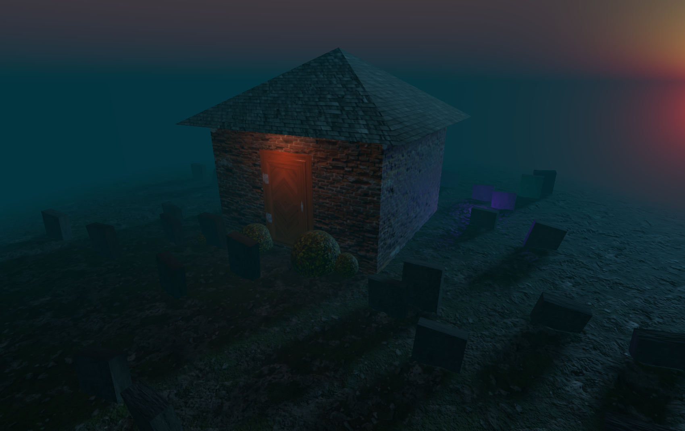

# 👻 Fun little haunted house build with Three.js

A spooky haunted house scene built with [Three.js](https://threejs.org/), created as part of the [Three.js Journey](https://threejs-journey.com/) course by Bruno Simon 👌

The project explores the fundamentals of creating a 3D scene in the browser using Three.js, including geometries, textures, materials, lighting, shadows, fog, animation, and camera controls.

This repository contains the base implementation following the course, along with my own customizations and experiments as the project continues to grow.

🚀 **Live Demo:**  
https://3d-haunted-house-by-dano.vercel.app/

## ✨ Features

- 🏚️ Haunted house built with Three.js geometries
- 🌙 Atmospheric night-time environment
- 👻 Animated ghost lights
- 💡 Multiple light sources
- 🌫️ Fog and atmospheric effects
- 🪦 Randomly positioned graves
- 🌿 Custom bushes and environment details
- 🖼️ Texture-based materials
- 🎥 Orbit camera controls
- 🌌 Procedural sky
- 🌑 Shadow mapping

## 🛠️ Built With

- [Three.js](https://threejs.org/)
- JavaScript
- Vite
- lil-gui
- HTML / CSS
